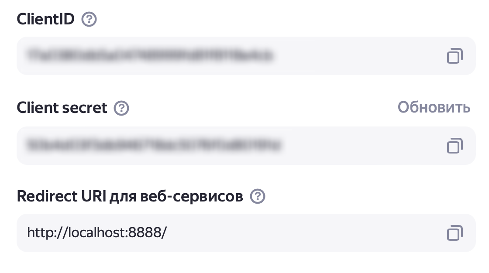

# StateExamSecretary


Ежегодно на кафедре системного программирования защищается порядка 50 студентов, а в заседаниях принимают участие около
20 членов ГЭК.

Работа с таким объемом данных отнимает значительное количество времени и сил, поэтому было принято решение максимально
автоматизировать процесс документальной подготовки к проведению ГЭК.

Данное приложение позволяет автоматически создавать папки запланированных заседаний и загружать в них все необходимые
документы, контролируя наличие файлов и корректность их названий, а также генерировать порядки дня для широкой публики и
оценочные листы – порядки дня с возможностью оценивания ВКР членами ГЭК.

## Сборка и запуск

1. Убедитесь, что у вас установлена последняя версия .NET SDK. Можно скачать с [официального сайта
   .NET](https://dotnet.microsoft.com/en-us/download/dotnet).
2. Клонируйте репозиторий:
   ```shell
   git clone https://github.com/yurii-litvinov/StateExamSecretary.git
   ```
3. Перейдите в папку проекта:
   ```shell
   cd StateExamSecretaryEngine
   ```
4. Установите зависимости:
   ```shell
   dotnet restore
   ```
5. Соберите проект:
   ```shell
   dotnet build
   ```
6. Для запуска проекта используйте следующую команду:
   ```shell
   dotnet run
   ```

При первом запуске программа создаст папку с файлом ```config.json```. Настройте конфиг и перезапустите программу для
начала работы.

## Настройка конфига

Установите для каждого параметра корректное значение:

* **Параметры расписания и тем ВКР:** укажите путь к файлу или ссылку на Яндекс.Диск. Для получения верной ссылки файл
  должен быть сохранен на вашем Диске.
* **Параметры сохранения порядков дня и загрузки файлов:** установите значение ```true```, если хотите
  сохранить/загрузить
  файлы на Яндекс.Диск, ```false``` – в ином случае.
* **Материалы:** укажите путь к папке с файлами, которые необходимо загрузить на Яндекс.Диск.
* **ClientID, Client secret, Redirect URI:** зарегистрируйте свое OAuth-приложение для работы с Яндекс.Диском, чтобы
  получить эти данные.

Пример файла ```config.json```:

```json
{
  "Расписание": "Расписание.xlsx",
  "Темы ВКР, бакалавры техпрога": "https://disk.yandex.ru/i/6c0cER7PSbpV6Q",
  "Темы ВКР, бакалавры ПИ": "https://disk.yandex.ru/i/6c0cER7PSbpV6Q",
  "Темы ВКР, магистры техпрога": "https://disk.yandex.ru/i/6c0cER7PSbpV6Q",
  "Темы ВКР, магистры ПИ": "https://disk.yandex.ru/i/6c0cER7PSbpV6Q",
  "Сохранить порядки дня на Яндекс.Диск": true,
  "Загрузить файлы на Яндекс.Диск": true,
  "Материалы": "/Users/mawekk/folder",
  "ClientID": "********************************",
  "Client secret": "********************************",
  "Redirect URI": "http://localhost:8888/"
}
```

## Регистрация OAuth-приложения для работы с Яндекс.Диском.

1. [Войдите](https://id.yandex.ru/) в аккаунт на Яндексе.
2. Откройте страницу [создания приложения](https://oauth.yandex.ru/client/new/).
3. Укажите название сервиса.
4. В разделе **Платформы приложения** выберите веб-сервисы и укажите redirect URI (например, http://localhost:8888/).
5. В разделе **Доступ к данным** укажите следующие права:
    * запись в любом месте на Диске — ```cloud_api:disk.write```;
    * чтение всего Диска — ```cloud_api:disk.read```;
    * доступ к информации о Диске — ```cloud_api:disk.info```.
6. Нажмите кнопку **Создать приложение**.

В открывшемся окне будут указаны необходимые для настройки конфига данные.

